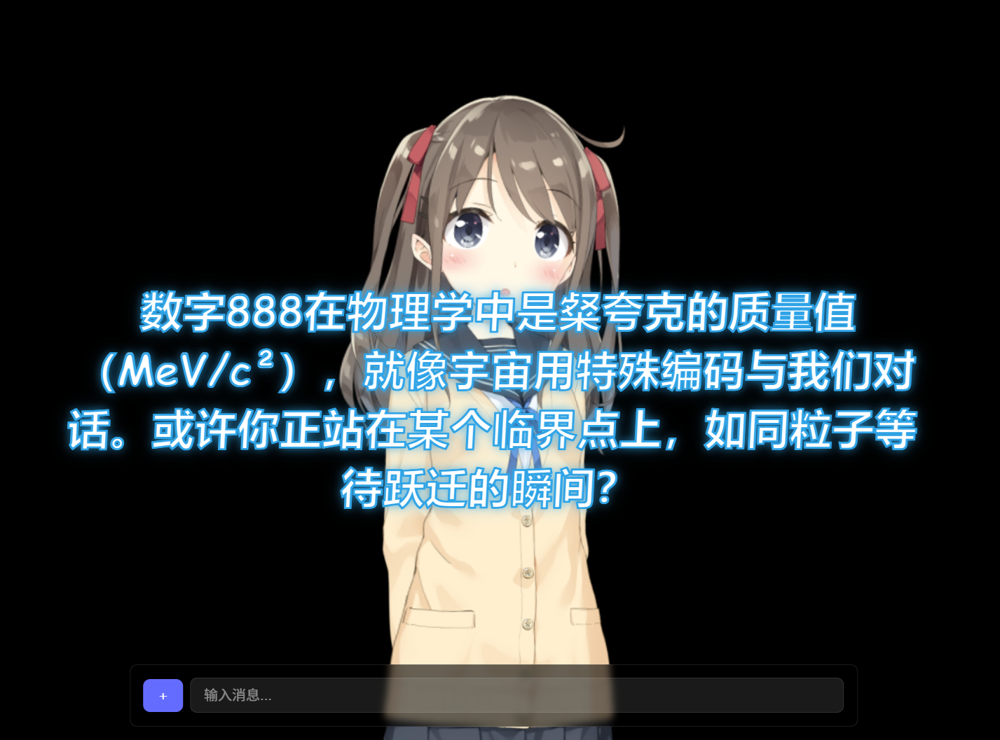
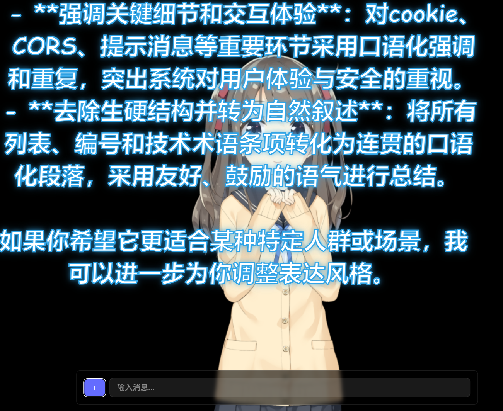

# 二次元AI学习伴侣
一个基于LLM和Live2D的二次元AI学习伴侣，支持文档阅读，语音输入输出，能够陪伴你学习和生活。
## 功能演示
聊天功能演示-输入“888”

文档处理功能演示-在左下角“+”号中放入一份身份验证系统说明文档


## 技术结构图

```
+------------------+     +-------------------+     +----------------+
|                  |     |                   |     |                |
|  ChatService     | --> |   MainAgent       | --> |   LLMService   |
| generate_reply() |     | reply(),          |     | generate_      |
|                  |     | _generate_reply() |     | response()     |
+------------------+     +-------------------+     +----------------+
        ↓                         ↓                        ↓
   Prepare Context         Build Prompt with         Call LLM API
                             Memory & History
        ↓                         ↓                        ↓
   Return Response       Process LLM Response     Send Request to
                            and Update History       Remote Server
```                            

## 安装说明

### 环境准备

- Node.js: v22 以上
- Python: 3.10 以上

确保你的系统已经安装了以上版本的环境，才能顺利运行本项(或者其他版本也可以，但我没试过)


### 前端安装
```bash
cd frontend
npm install
```

### 后端安装
```bash
cd backend
# 创建虚拟环境
python -m venv venv
# Windows激活虚拟环境
.\venv\Scripts\activate
# Linux/Mac激活虚拟环境
source venv/bin/activate

# 安装依赖
pip install fastapi uvicorn openai python-dotenv PyDocX PyPDF2
```


### 后端配置
- LLM和向量模型的配置见 [./backend/config.py](backend/config.py) 文件
- 线上模型暂时是使用deepseek api，需要去deepseek官网注册账号并获取API Key，添加到环境变量中
- TTS服务使用了Fish Audio的API，需要注册账号并获取API Key，网址 https://fish.audio/zh-CN/ 。如果不想使用TTS，可以把FISH_API_KEY设置为空字符串，程序会默认不用。有TTS


## 运行说明
linux 下一键启动：在主目录中运行脚本
```bash
./run.sh
```

windows 一键启动：在主目录中运行脚本
```bash
./start_all.bat
```
### 前后端分开启动
启动前端
```bash
cd frontend
npm run dev
```
前端将在 http://localhost:3000 启动

启动后端
```bash
cd backend
uvicorn main:app --reload --host 0.0.0.0 --port 8000
```
后端API将在 http://localhost:8000 启动。后端位置比较关键，因为前端会默认到这里去请求数据。


## 使用说明

- 角色设定保存在[backend/prompts/reply.txt](backend/prompts/reply.txt)文件夹中，这是最为关键的提示词，可以自行修改。backend/prompts/文件夹下还放了一些人设txt文件，要使用时就把内容粘贴到reply.txt中。

### 前后端技术文档
- 前端技术文档见 [./frontend/README_frontend_cn.md](frontend/README_frontend_cn.md)
- 后端技术文档见 [./backend/README.md](backend/README.md)

### 联系作者
欢迎在github仓库页面提issue. 可以给作者发邮件，邮箱: 1074038570@qq.com .

### 特别感谢
本项目从项目https://github.com/mewamew/nana 魔改而来，删掉了原项目中的embedding做法，就让ai用一句话'user_info'记下用户信息，提升了项目的可靠性。
live2d模型是原作者在工坊买的，仅供学习交流使用，请勿用于商业用途！！！

