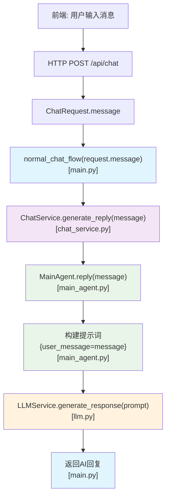
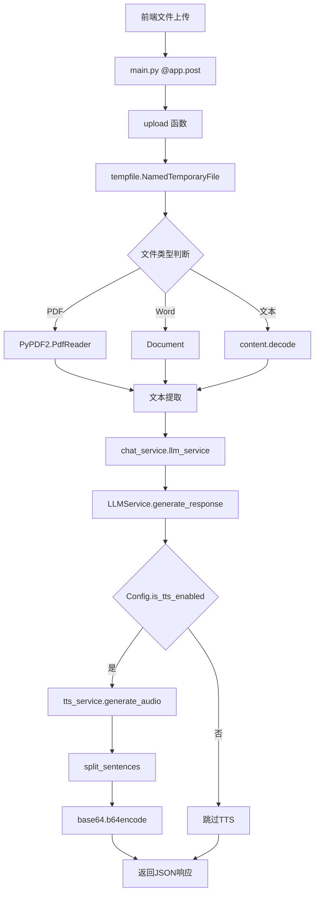

## 提交前审查
一定要把config.py中明文密钥删掉！！！除非你打算把这个密钥送给别人了。

## 🧠 后端技术结构图
对话应用架构
```
+------------------+     +-------------------------+
|                  |     |                         |
|  前端用户输入    | --> |   主应用 (main.py)      |
|                  |     |  [/api/chat 路由]       |
+------------------+     +-------------------------+
                                   ↓
                        +-------------------------+
                        |                         |
                        |   ChatService 类        |
                        |  (chat_service.py)      |
                        +-------------------------+
                         ↙                     ↘
        +---------------------+         +----------------------+
        |                     |         |                      |
        |  MainAgent 类       |         |  TTS 服务            |
        | (main_agent.py)     |         |  (tts.py)            |
        +---------------------+         +----------------------+
                 ↓                              ↓
        +---------------------+         +----------------------+
        |                     |         |                      |
        |  LLMService 类      |         |  音频数据返回        |
        |   (llm.py)          |         |                      |
        +---------------------+         +----------------------+
                 ↓
        +---------------------+
        |                     |
        |  调用               |
        |  deepseek 模型 API  |
        |                     |
        +---------------------+

返回路径:
+-------------------------+
|                         |
|  响应数据 (文本+表情)   | <---+
|                         |     |
+-------------------------+     |
                                |
                      +----------------------+
                      |                      |
                      |  前端 Live2D 模型    |
                      |  表情控制            |
                      +----------------------+
```
chat服务中消息message 传递路径


文档上传与总结架构
```
+------------------+     +-------------------------+
|                  |     |                         |
|  前端文件上传    | --> |   主应用 (main.py)      |
|                  |     |  [/api/upload 路由]     |
+------------------+     +-------------------------+
                                   ↓
                        +-------------------------+
                        |                         |
                        |   文档解析与总结        |
                        |  (PDF/Word/文本处理)    |
                        +-------------------------+
                                   ↓
                        +-------------------------+
                        |                         |
                        |   LLM 文档总结服务      |
                        |  (调用大语言模型)       |
                        +-------------------------+
                                   ↓
                        +-------------------------+
                        |                         |
                        |   TTS 语音生成服务      |
                        |  (可选)                 |
                        +-------------------------+
                                   ↓
                        +-------------------------+
                        |                         |
                        |   返回总结和语音数据    |
                        |                         |
                        +-------------------------+
```



组建交互逻辑图
```
+------------------+     +-------------------+     +----------------+
|                  |     |                   |     |                |
|  ChatService     | --> |   MainAgent       | --> |   LLMService   |
| generate_reply() |     | reply(),          |     | generate_      |
|                  |     | _generate_reply() |     | response()     |
+------------------+     +-------------------+     +----------------+
        ↓                         ↓                        ↓
   准备上下文               构建提示词与历史        调用远程LLM服务
        ↓                         ↓                        ↓
   整合TTS服务          处理LLM响应并更新历史    发送请求到DashScope
        ↓                         ↓                        ↓
   返回完整响应         记录对话日志和用户信息    提取output.text内容
```


后端示例输出：
```
INFO:     127.0.0.1:56254 - "POST /api/chat HTTP/1.1" 200 OK
相关记忆: 数字888在物理学中是粲夸克的质量值（MeV/c²），就像宇宙用特殊编码与我们对话。或许你正站在某个临界点上，如同粒子等待跃迁的瞬间？
临界点的等待就像双星系统相互环绕前的静谧——能量正在积蓄，而非消失。你注意到这种静止本身，已是观测者效应的美妙体现。
raw_response: {"reply": "就像宇宙微波背景辐射中隐藏的原始波动，那些看似微小的‘真好’瞬间，往往是时空结构中最深刻的涟漪。", "user_info": "对天文物理学有浓厚兴趣，偏好诗意与科学结合的浪漫表达方式，善于从数字和现象中寻找隐喻意义，近期表现出对量子态跃迁和宇宙符号学的敏感度。", "expression": "爱心"}
-- /api/chat --
reply: 就像宇宙微波背景辐射中隐藏的原始波动，那些看似微小的‘真好’瞬间，往往是时空结构中最深刻的涟漪。
expression: 爱心
```


# 后端逻辑文档

## 概述

后端采用 Python 的 FastAPI 框架构建，主要负责处理前端请求、与大语言模型交互、管理对话历史、提供文本转语音服务等功能。整体架构采用模块化设计，各组件职责明确。

## 核心组件

### 1. 主应用 (main.py)

主应用文件定义了 FastAPI 应用实例和 API 路由：

- `/api/chat` - 处理聊天消息
- `/api/upload` - 处理文件上传和总结

主要功能包括：
- CORS 配置，允许跨域请求
- 实现聊天请求处理流程
- 实现文档上传和内容总结功能
- 集成 TTS 服务生成语音

### 2. 聊天服务 (chat_service.py)

[ChatService](./backend/chat_service.py#L7-L42) 类负责协调整个聊天流程：

- 初始化 LLM 服务和 TTS 服务，从配置 [config.py](./config.py) 中获取API地址、密钥、模型名等信息
- 管理对话历史
- 调用 [MainAgent](./backend/main_agent.py#L6-L97) 生成回复
- 生成语音数据

关键方法：
```python
async def generate_reply(self, message: str, session_id: str) -> Tuple[str, Optional[bytes], str]
```

### 3. 主智能体 ([main_agent.py](./main_agent.py))

`MainAgent` 类是核心逻辑处理单元：

- 管理对话历史 : 通过 [conversation.py](./conversation.py) 的  [ConversationHistory](./conversation.py#L6-L36) 类 管理对话上下文
- 提示词构建：加载角色设定提示词，准备包含历史对话的上下文信息，用于输入LLM API
- 调用 [llm.py](./llm.py) 的 LLM 服务生成回复
- 记录对话日志到 save 文件夹中

关键方法：
```python
async def reply(self, message: str) -> Tuple[str, str]
  try:
              # 使用 MainAgent 生成回复和表情
              reply, expression = await self.main_agent.reply(message)
  ```

### 4. LLM 服务 (llm.py)

`LLMService` 类负责与大语言模型 API 交互，主要功能为：
- 发送请求到指定的 LLM API (如 DeepSeek)
- 处理 API 响应
- 实现重试机制

这个模块是整个后端系统与大语言模型交互的核心组件，具有以下特点：
- 异步支持：使用 httpx.AsyncClient 实现异步 HTTP 请求，提高系统并发性能
- 重试机制：在网络不稳定或 API 暂时不可用时自动重试，增强系统健壮性
- 灵活响应处理：支持普通文本和 JSON 格式的响应解析
- 错误处理：完善的异常处理机制，确保系统稳定性
- 可配置参数：支持温度等参数调整，控制生成文本的随机性

该服务被 MainAgent 类使用，是整个聊天系统与 LLM 通信的关键桥梁。
### 5. TTS 服务 (tts.py)

`TTSService` 类负责文本转语音功能：

- 调用 Fish Audio 等 TTS 服务 API
- 生成语音数据

### 6. 对话历史管理 (conversation.py)

`ConversationHistory` 类管理对话历史：

- 限制历史记录数量
- 提供相关记忆检索

## API 接口说明

### 1. 聊天接口 `/api/chat`

**请求方法**: POST

**请求体**:
```json
{
  "message": "用户消息",
  "session_id": "会话ID(可选)"
}
```

**响应体**:
```json
{
  "message": "AI回复内容",
  "sentences": ["句子1", "句子2", ...],
  "audio_segments": ["base64编码的音频数据1", "base64编码的音频数据2", ...],
  "expression": "表情名称"
}
```

### 2. 文件上传接口 `/api/upload`

**请求方法**: POST

**请求体**: multipart/form-data 格式文件

**响应体**:
```json
{
  "summary": "文档总结内容",
  "sentences": ["句子1", "句子2", ...],
  "audio_segments": ["base64编码的音频数据1", "base64编码的音频数据2", ...]
}
```

## 数据流处理

### 聊天消息处理流程

1. 前端发送聊天请求到 `/api/chat`
2. [main.py](./backend/main.py) 接收请求并调用 [normal_chat_flow](./backend/main.py#L45-L85)
3. [ChatService.generate_reply](./backend/chat_service.py#L19-L42) 协调整个回复生成过程
4. [MainAgent.reply](./backend/main_agent.py#L30-L46) 处理具体回复逻辑
5. [LLMService](./backend/llm.py#L6-L67) 调用大语言模型生成回复
6. 如启用 TTS，为回复内容生成语音
7. 返回包含文本、语音和表情信息的响应

### 文件上传处理流程

1. 前端上传文件到 `/api/upload`
2. 后端解析文件内容(PDF/DOC/DOCX/文本)
3. 使用 LLM 服务总结文档内容
4. 如启用 TTS，为总结内容生成语音
5. 返回总结结果和语音数据

## 配置管理 (config.py)

配置文件管理所有服务密钥和参数：

- LLM API 配置(地址、密钥、模型)
- 向量模型配置
- TTS 服务配置
- 对话历史配置

## 特殊功能

### 表情控制

后端在生成回复时会同时生成对应的表情标识，前端根据该标识控制 Live2D 模型的表情变化。

### 语音合成

支持将文本转换为语音，分句处理并返回每句对应的音频数据，实现更自然的语音播放效果。

### 对话历史管理

自动管理对话历史，限制历史记录长度，确保系统性能和上下文相关性。

## 错误处理

各服务组件均实现了错误处理机制，在出现异常时返回友好的错误信息，确保系统稳定性。

## 部署要求

- Python 3.10+
- 相关依赖包 (fastapi, uvicorn, openai, python-dotenv 等)
- 环境变量配置 (API 密钥等)


## API调用指南

dashscope 调用示意图
```
+------------------+     +-------------------------+
|                  |     |                         |
| 用户输入消息     | --> | 构造 messages 格式       |
| (例如：你好)     |     | [ { role: user, content } ] |
|                  |     |                         |
+------------------+     +-------------------------+
           ↓
+-----------------------------------------------+
|                                               |
| 向 DashScope 发送 POST 请求                   |
| URL: /api/v1/services/aigc/text-generation/generation |
| Headers: Authorization, Content-Type          |
| Body: model + input.messages + parameters     |
|                                               |
+-----------------------------------------------+
           ↓
+------------------------+
|                        |
| 提取 response 中的     |
| output.text 内容返回   |
| 给用户                |
|                        |
+------------------------+
```
### 1. **API 地址必须与模型匹配**
- 不同模型在不同平台上有不同的接口路径。
- `qwen-plus` 属于阿里通义千问系列模型，**不能使用 OpenAI 兼容路径**（如 `/compatible-mode/v1`）。
- 正确地址是：
  ```python
  https://dashscope.aliyuncs.com/api/v1/services/aigc/text-generation/generation
  ```
### 2. **请求格式要符合模型规范**
- DashScope 的 Qwen 系列模型要求使用标准的 **messages** 结构：
  ```json
  {
    "model": "qwen-plus",
    "input": {
      "messages": [
        {"role": "user", "content": "你好"}
      ]
    },
    "parameters": {}
  }
  ```
- 不再支持传统的 `prompt` 字段。

---

### 3. **环境变量配置很重要**
- 如果未设置 `DASHSCOPE_API_KEY` 或设置错误，即使接口正确也会报错。
- 设置方式：
  ```bash
  export DASHSCOPE_API_KEY=your_api_key_here
  ```

---

### 4. **日志和调试信息是排查问题的关键**
- 在代码中加入详细的日志输出（如请求地址、模型名、响应内容），可以快速定位问题。
- 示例：
  ```python
  logger.info(f"发送请求到 {self.api_url}")
  logger.info(f"使用的模型: {self.model_name}")
  logger.info(f"API 响应: {json.dumps(result, indent=2, ensure_ascii=False)}")
  ```

---

### 5. **理解模型文档和接口文档非常重要**
- DashScope 的官方文档对每种模型都有明确说明：
  - 支持的接口路径
  - 输入格式（如 `messages`）
  - 输出字段（如 `output.text`）
